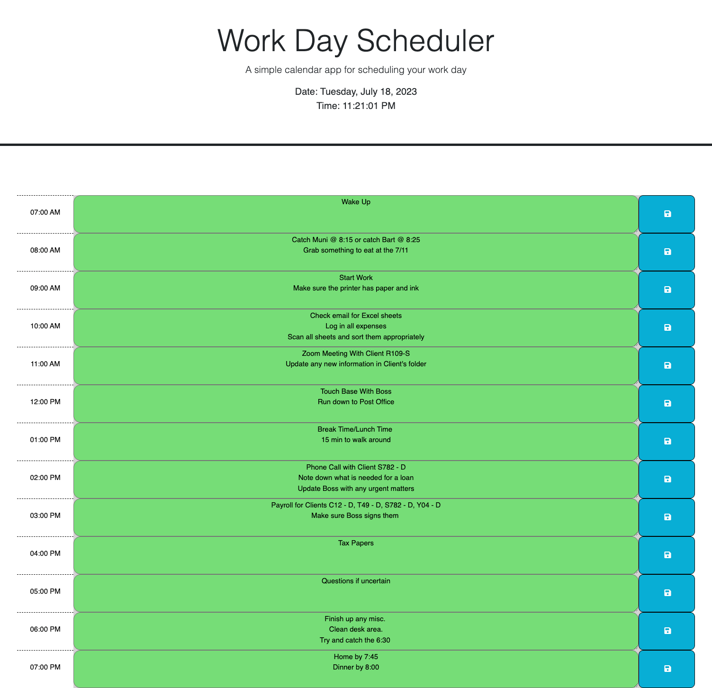

# Daytracker

Use code from [Day.js](https://day.js.org/) and [jQueryUI](https://api.jqueryui.com/) to help keep track of your busy day.

## Description

Create a calendar app that allows users to record events for each hour of the work day.

## Source of starter code

Crispy-octo-meme: https://github.com/coding-boot-camp/crispy-octo-meme

## How it works

The link opens to the current day, organized into hourly blocks from 9 a.m. to 5 p.m.

Each time block is color-coded to represent a certain time:

- **GREY** for the past
- **RED** for the present
- **GREEN** for the future

To add an event, click the time block and then the save icon.

## Demo Gif

## Preview

## Link to install

No installation required. Click on the link below:
https://clkwong3.github.io/Daytracker/
