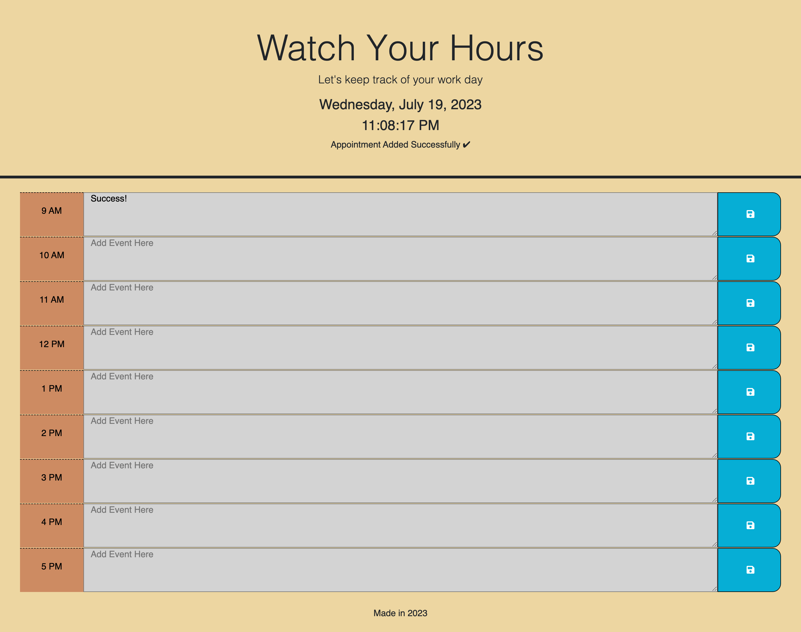

# Daytracker

Use code from [Bootstrap](https://getbootstrap.com/docs/5.3/getting-started/introduction/), [Day.js](https://day.js.org/), and [jQueryUI](https://api.jqueryui.com/) to help keep track of your busy day.

## Description

Create a calendar app that allows users to record events for each hour of the work day.

## Source of starter code

Crispy-octo-meme: https://github.com/coding-boot-camp/crispy-octo-meme

## How it works

Enter your tasks into a block before hitting the save disk to update.
If you like to remove a task, delete then hit the disk.

The day is organized into hourly blocks from 9 a.m. to 5 p.m.
Each time block is color-coded to represent a certain time:

- **GREY**: The hour is gone
- **RED**: The current hour
- **GREEN** The hour is coming up

## Demo Gif

## Preview

## Link to install

No installation required. Click on the link here: https://clkwong3.github.io/Daytracker/
